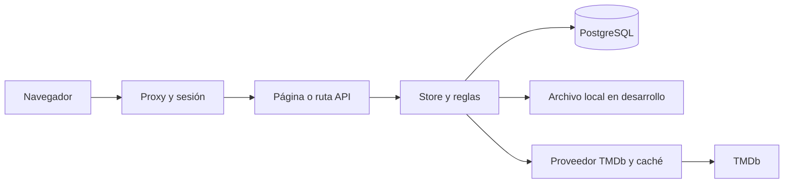

# Arquitectura y datos

[Inicio](../README.md) · [Reglas funcionales](funcionalidad.md) · [Operación](operacion.md)

## Mapa del repositorio

| Ubicación | Responsabilidad |
| --- | --- |
| [app](../app) | Páginas, layouts y rutas HTTP de Next.js |
| [src/components](../src/components) | Componentes de interfaz y formularios |
| [proxy.ts](../proxy.ts) | Control de acceso previo a páginas y API |
| [store.ts](../src/lib/store.ts) | Composición de servicios, carga de estado, disponibilidad de datos y transacciones; mantiene los exports que consumen páginas y API |
| [state-readers.ts](../src/lib/state-readers.ts) y [state-cache.ts](../src/lib/state-cache.ts) | Índices y consultas del estado compartidos por los dominios; copias y caducidad de cachés |
| [users/records.ts](../src/lib/users/records.ts) | Lecturas de usuarios, selección y conversión de registros, normalización de credenciales y escrituras Prisma |
| [users/authentication.ts](../src/lib/users/authentication.ts) | Login y validación de sesiones con un cargador explícito de credenciales vigentes |
| [users/service.ts](../src/lib/users/service.ts) | Edición de perfil, gestión administrativa y recuperación de credenciales dentro del coordinador de mutaciones |
| [users/profiles.ts](../src/lib/users/profiles.ts) | Resúmenes, clasificaciones y distribución de notas de perfiles; cachés por estado e invalidación |
| [movies/records.ts](../src/lib/movies/records.ts) | Conversión de registros y escrituras de catálogo, pendientes y vistas |
| [movies/service.ts](../src/lib/movies/service.ts) | Añadir y quitar pendientes, marcar vistas y estado de colección en búsquedas |
| [movies/metadata-writer.ts](../src/lib/movies/metadata-writer.ts) | Preparación fuera del bloqueo, comprobación de cambios concurrentes y guardado transaccional de metadatos desde páginas |
| [movies/metadata.ts](../src/lib/movies/metadata.ts) | Detección y enriquecimiento de metadatos conservando ID y slug locales |
| [ratings/records.ts](../src/lib/ratings/records.ts) y [ratings/service.ts](../src/lib/ratings/service.ts) | Conversión y escritura de notas; validación, comentarios y actualización por usuario/película |
| [record-dates.ts](../src/lib/record-dates.ts) | Conversión de fechas opcionales de vistas y notas a registros de base de datos |
| [types.ts](../src/lib/types.ts) | Tipos de usuarios, películas, notas, tandas y estado agregado |
| [prisma.ts](../src/lib/prisma.ts) y [schema.prisma](../prisma/schema.prisma) | Cliente y esquema PostgreSQL |
| [normalized-state.ts](../src/lib/normalized-state.ts) | Composición de tablas normalizadas y snapshot compacto |
| [state-persistence.ts](../src/lib/state-persistence.ts) y [mutation-lock.ts](../src/lib/mutation-lock.ts) | Confirmación durable, bloqueo transaccional y cola local |
| [local-state-storage.ts](../src/lib/local-state-storage.ts) | Archivo local y compatibilidad con la cola histórica de escrituras |
| [session.ts](../src/lib/session.ts), [api-session.ts](../src/lib/api-session.ts), [public-user.ts](../src/lib/public-user.ts) | Sesiones, resolución de usuario y proyección de campos públicos |
| [user-input.ts](../src/lib/user-input.ts) y [request-security.ts](../src/lib/request-security.ts) | Credenciales, validación, origen y límites de intentos |
| [movie-provider.ts](../src/lib/movie-provider.ts) y [movie-search.ts](../src/lib/movie-search.ts) | TMDb, enriquecimiento, ranking y deduplicación de búsquedas |
| [recommendations.ts](../src/lib/recommendations.ts) y [weekly-selection.ts](../src/lib/weekly-selection.ts) | Recomendaciones y reglas de selección |
| [recommendations/service.ts](../src/lib/recommendations/service.ts) y [recommendations/records.ts](../src/lib/recommendations/records.ts) | Renovación, generación y selección de tandas; conversión y persistencia de registros |
| [recommendations/suggestions.ts](../src/lib/recommendations/suggestions.ts) | Estrenos, cartelera, descubrimiento y sugerencias de pendientes; enriquecimiento y cachés de resultados |
| [pages/dashboard.ts](../src/lib/pages/dashboard.ts) | Datos del inicio y resumen del grupo |
| [pages/history.ts](../src/lib/pages/history.ts) y [pages/pending.ts](../src/lib/pages/pending.ts) | Lecturas locales/PostgreSQL, filtros, destacados y paginación de vistas y pendientes |
| [pages/profiles.ts](../src/lib/pages/profiles.ts) y [pages/movie-detail.ts](../src/lib/pages/movie-detail.ts) | Datos de perfiles, grupo y ficha de película; cachés por usuario |
| [pages/types.ts](../src/lib/pages/types.ts) | Contratos compartidos de páginas y fecha de respaldo del historial |
| [environment-safety.ts](../src/lib/environment-safety.ts), [data-availability.ts](../src/lib/data-availability.ts) | Separación de entornos y comportamiento ante fallos de datos |
| [operational-health.ts](../src/lib/operational-health.ts), [operational-errors.ts](../src/lib/operational-errors.ts) | Salud y respuestas de error con identificador de incidencia |
| [scripts](../scripts), [tests](../tests), [e2e](../e2e), [.github/workflows](../.github/workflows) | Operación, pruebas y entrega |

## Flujo de una petición

Los componentes cliente usan las API para las acciones. Las páginas de servidor consultan el store. Una ruta valida sesión, origen y entrada, ejecuta la operación y devuelve JSON o una redirección; algunas rutas invalidan páginas con `revalidatePath`.

### Separación del dominio de usuarios

El store crea los servicios de usuarios y les entrega únicamente las dependencias que necesitan. Los módulos de `users/` no importan `store.ts`, no crean otro coordinador de escrituras y no dependen de módulos de páginas. La API de importación existente desde el store se conserva para evitar cambios en los consumidores durante esta extracción.

`authentication.ts` recibe un cargador de credenciales frescas; sus comprobaciones de token y login no añaden caché entre peticiones. `service.ts` recibe `mutateState`, por lo que sus validaciones y persistencia continúan dentro del mismo bloqueo que las películas y recomendaciones. Los tipos compartidos del coordinador se definen en `state-persistence.ts`.

`users/profiles.ts` conserva por separado los cálculos de la lectura local y de base de datos, incluidas sus reglas de clasificación y distribución; no introduce cambios de estadísticas. El store llama a su invalidación cuando cambia un estado. `pages/profiles.ts` prepara los datos de pantalla usando esos cálculos; la disponibilidad de la base sigue coordinándose en el store.

### Separación de películas y notas

El store compone `movies/service.ts` y `ratings/service.ts` y conserva sus exports públicos. Ambos reciben el mismo `mutateState` que usuarios y recomendaciones; ninguno importa el store. Los módulos de registros reciben el cliente transaccional del coordinador para guardar catálogo, colección y notas junto al snapshot. Las funciones de sincronización masiva se mantienen para bootstrap local y compatibilidad histórica. Las escrituras de metadatos desde páginas usan operaciones por película dentro del coordinador.

Al añadir una pendiente, el servicio prepara los metadatos antes de entrar en el coordinador y comprueba la colección con el estado recibido tras el bloqueo. Así respeta que otro usuario haya marcado la película como vista durante la espera de TMDb. Al marcar una vista, elimina la pendiente en la misma transacción. Las búsquedas resuelven la identidad local para informar si un resultado remoto ya está pendiente o visto.

`movies/metadata.ts` conserva ID y slug locales al enriquecer una película. `ratings/service.ts` conserva los incrementos de 0,25, la nota cero, el límite de comentarios y la identidad de una nota al editarla.

### Recomendaciones y preparación de páginas

`recommendations/service.ts` recibe el coordinador compartido para `getCurrentBatch`, `generateBatch` y `selectWeeklyMovie`. `loadStateWithCurrentBatch` comparte la renovación entre `getCurrentBatch` y la lectura PostgreSQL de Pendientes: lee el estado tras adquirir el bloqueo, valida la tanda, guarda sus cambios junto al snapshot y devuelve ese mismo estado para preparar la página. Mantiene la validación de tandas, la selección entre recomendaciones o pendientes y el descarte de selecciones ya vistas. El algoritmo de puntuación permanece en `recommendations.ts`. `recommendations/suggestions.ts` reúne consultas al proveedor, enriquecimiento y resultados de estrenos, cartelera y descubrimiento.

Cada módulo de `pages/` prepara una familia de pantallas, conserva las rutas de lectura local y PostgreSQL y recibe del store cargadores de datos y controles de disponibilidad. No importa `store.ts`. La composición es unidireccional: store → servicios/lectores → reglas y registros. Las consultas de catálogo y usuarios, la reconstrucción del estado y el control de fallos permanecen en el store; este conecta el escritor de metadatos con el coordinador compartido.

El store crea una instancia de cada lector y comparte sus índices. Tras una mutación invalida los índices, cálculos de perfil y cachés de páginas y sugerencias, conservando los momentos de invalidación anteriores. Los filtros, el orden de desempate, la paginación y las claves que separan las notas por usuario se mantienen. No se unifican los cálculos locales y SQL en esta extracción; por ejemplo, el desempate del destacado de Vistas sigue siendo distinto entre ambas rutas cuando las medias coinciden.

## Fuente de verdad

En despliegues con base de datos, las colecciones proceden de tablas normalizadas. `AppSnapshot` conserva contexto agregado, especialmente grupo y actividad reciente. Una colección vacía es válida y no debe repoblarse con una copia antigua.

| Tabla | Contenido y restricciones principales |
| --- | --- |
| `UserRecord` | Perfil, hash y rol; ID y username únicos |
| `MovieRecord` | ID, slug único y metadatos JSON |
| `PendingMovie` | Clave compuesta `(groupId, movieId)` |
| `WatchEntryRecord` | `movieId` único; fecha y semana asociada opcionales |
| `RatingRecord` | Una fila por `(movieId, userId)` |
| `WeeklyBatchRecord` | Tanda, fechas, grupo y película seleccionada opcional |
| `WeeklyBatchItemRecord` | Elementos ordenados, puntuaciones, razones y métricas; relación con tanda y borrado en cascada |
| `AppSnapshot` | JSON agregado identificado por `APP_SNAPSHOT_ID` |
| `TmdbCacheEntry` | Respuestas del proveedor con fecha de caducidad |

La única relación foránea declarada en Prisma es elemento → tanda. Otras relaciones y la exclusión entre Pendientes y Vistas dependen del código y de los controles de integridad. Cambiar `APP_SNAPSHOT_ID` **no aísla las tablas**. Para separar Preview y Producción se necesitan bases o ramas de Neon independientes.

Si falta el snapshot, se utiliza el contexto inicial del grupo y se leen las tablas, incluso vacías. En Preview/Producción, una consulta fallida o un snapshot malformado bloquea el acceso en lugar de sustituirlo por datos locales. El store conserva rutas de bootstrap y recuperación locales para desarrollo; no son un procedimiento de recuperación de Producción.

Sin `DATABASE_URL`, se usa `APP_DATA_DIR/runtime-state.json` o `data/runtime-state.json`. El estado inicial se construye con [demo-data.ts](../src/lib/demo-data.ts) y [manual-history.ts](../src/lib/manual-history.ts). Ese archivo no se sincroniza automáticamente con Producción.

## Escrituras y concurrencia

Las diez operaciones públicas coordinadas son `getCurrentBatch`, `updateUserProfile`, `updateUserCredentialsByAdmin`, `resetUserCredentials`, `upsertRating`, `generateBatch`, `selectWeeklyMovie`, `markMovieAsWatched`, `addPendingMovie` y `removePendingMovie`. También pasan por `mutateState` la renovación desde la lectura PostgreSQL de Pendientes y el guardado de metadatos enriquecidos desde páginas.

En PostgreSQL:

1. Se comprueba la disponibilidad y se atiende la compatibilidad con escrituras históricas diferidas.
2. Se abre una transacción `ReadCommitted` y se adquiere `pg_advisory_xact_lock(1128877637, 1)`.
3. Después del bloqueo, se leen snapshot y tablas con el mismo cliente transaccional.
4. Se valida y modifica una copia del estado; las escrituras relacionadas y el snapshot se guardan juntos.
5. El commit libera el bloqueo. Solo entonces se publica la caché y se invalidan datos derivados.

El bloqueo es común a la base, no al proceso ni al snapshot. Prisma espera hasta 10 segundos para adquirir una transacción; esta tiene un límite de 30 segundos, incluida la espera por el bloqueo. Los fallos Prisma se presentan como indisponibilidad temporal. La consulta de metadatos de una película añadida se prepara antes de entrar en la transacción.

Esta coordinación cubre las operaciones y escrituras de páginas indicadas. **Los scripts administrativos, la consola SQL y la reproducción de escrituras históricas no quedan protegidos automáticamente por ella.** No deben ejecutarse en paralelo con escrituras de usuarios. El bloqueo global es adecuado para el grupo actual; debe reevaluarse antes de ampliar mucho el uso.

`hydrateMoviesForDatabaseRead` deduplica películas y prepara copias enriquecidas antes de bloquear. Dentro de la transacción compara cada película vigente con la copia que inició la consulta. Si ha cambiado, conserva la versión vigente; si ha desaparecido, no la recrea. Guarda solo los metadatos aceptados junto al snapshot y actualiza los objetos de la página después del commit. Si TMDb no aporta cambios, no abre una mutación. Los fallos de persistencia se propagan, sin devolver una lectura alternativa que aparente haber guardado los cambios.

La renovación de tanda y el enriquecimiento posterior son transacciones separadas: un fallo de metadatos no deshace una tanda que ya se confirmó. Tampoco se bloquea toda la renderización; otros usuarios pueden seguir modificando el grupo después de obtener los datos de una página. Estas garantías protegen las escrituras, no convierten la pantalla en una vista inmóvil de la base.

En modo archivo, una cola dentro del proceso ordena lectura, modificación y reemplazo atómico del archivo. Solo se admite una instancia local. No ofrece coordinación entre procesos o equipos.

## Lecturas y cachés

[runtime-cache-policy.ts](../src/lib/runtime-cache-policy.ts) desactiva las cachés mutables de páginas entre peticiones cuando se usa PostgreSQL, para que distintas instancias lean la base compartida. La memoización de React puede reutilizar datos dentro de una petición. La autenticación consulta las credenciales vigentes sin una caché de usuarios entre peticiones.

TMDb tiene cachés propias, distintas de los datos editados por el grupo: búsqueda y descubrimiento 12 horas, detalles 14 días, cartelera y próximos estrenos 6 horas. Los tiempos y la versión de metadatos se definen en `movie-provider.ts`.

Además, `recommendations/suggestions.ts` mantiene resultados de estrenos y cartelera durante 15 minutos en cada instancia. Son cachés separadas de las respuestas TMDb y se invalidan tras las mutaciones procesadas por esa instancia; no disponen de invalidación distribuida. Las cachés de páginas locales conservan su duración de dos minutos.

## Seguridad y límites

Las contraseñas se guardan con scrypt y sal aleatoria. La cookie `cine.session` dura 30 días, es HttpOnly y SameSite=Lax; usa Secure cuando `NODE_ENV=production`. Su formato v2 contiene identidad, caducidad, una marca HMAC ligada a las credenciales y firma; no contiene el hash de contraseña. `SESSION_SECRET` es obligatorio y debe tener al menos 32 caracteres en un build de producción.

El proxy protege páginas y API; `/api/health` valida su propio secreto. Los hashes y otros campos privados se mantienen en el servidor mediante una proyección explícita al cliente. `isAdmin` es un dato explícito, nunca una inferencia del nombre.

El control de origen comprueba Origin o Referer cuando existen; su ausencia no causa rechazo. Los límites de intentos de autenticación viven en memoria por instancia, no en un contador distribuido. Estas limitaciones deben preservarse en la documentación al valorar nuevos controles.
