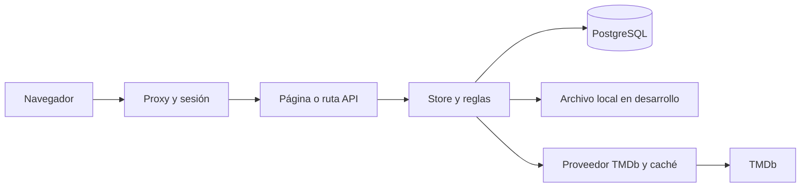

# Arquitectura y datos

[Inicio](../README.md) · [Reglas funcionales](funcionalidad.md) · [Operación](operacion.md)

## Mapa del repositorio

| Ubicación | Responsabilidad |
| --- | --- |
| [app](../app) | Páginas, layouts y rutas HTTP de Next.js |
| [src/components](../src/components) | Componentes de interfaz y formularios |
| [proxy.ts](../proxy.ts) | Control de acceso previo a páginas y API |
| [store.ts](../src/lib/store.ts) | Consultas, preparación de páginas y mutaciones del dominio; sigue siendo el módulo principal |
| [types.ts](../src/lib/types.ts) | Tipos de usuarios, películas, notas, tandas y estado agregado |
| [prisma.ts](../src/lib/prisma.ts) y [schema.prisma](../prisma/schema.prisma) | Cliente y esquema PostgreSQL |
| [normalized-state.ts](../src/lib/normalized-state.ts) | Composición de tablas normalizadas y snapshot compacto |
| [state-persistence.ts](../src/lib/state-persistence.ts) y [mutation-lock.ts](../src/lib/mutation-lock.ts) | Confirmación durable, bloqueo transaccional y cola local |
| [local-state-storage.ts](../src/lib/local-state-storage.ts) | Archivo local y compatibilidad con la cola histórica de escrituras |
| [session.ts](../src/lib/session.ts), [api-session.ts](../src/lib/api-session.ts), [public-user.ts](../src/lib/public-user.ts) | Sesiones, resolución de usuario y proyección de campos públicos |
| [user-input.ts](../src/lib/user-input.ts) y [request-security.ts](../src/lib/request-security.ts) | Credenciales, validación, origen y límites de intentos |
| [movie-provider.ts](../src/lib/movie-provider.ts) y [movie-search.ts](../src/lib/movie-search.ts) | TMDb, enriquecimiento, ranking y deduplicación de búsquedas |
| [recommendations.ts](../src/lib/recommendations.ts) y [weekly-selection.ts](../src/lib/weekly-selection.ts) | Recomendaciones y reglas de selección |
| [environment-safety.ts](../src/lib/environment-safety.ts), [data-availability.ts](../src/lib/data-availability.ts) | Separación de entornos y comportamiento ante fallos de datos |
| [operational-health.ts](../src/lib/operational-health.ts), [operational-errors.ts](../src/lib/operational-errors.ts) | Salud y respuestas de error con identificador de incidencia |
| [scripts](../scripts), [tests](../tests), [e2e](../e2e), [.github/workflows](../.github/workflows) | Operación, pruebas y entrega |

## Flujo de una petición

Los componentes cliente usan las API para las acciones. Las páginas de servidor consultan el store. Una ruta valida sesión, origen y entrada, ejecuta la operación y devuelve JSON o una redirección; algunas rutas invalidan páginas con `revalidatePath`.

## Fuente de verdad

En despliegues con base de datos, las colecciones proceden de tablas normalizadas. `AppSnapshot` conserva contexto agregado, especialmente grupo y actividad reciente. Una colección vacía es válida y no debe repoblarse con una copia antigua.

| Tabla | Contenido y restricciones principales |
| --- | --- |
| `UserRecord` | Perfil, hash y rol; ID y username únicos |
| `MovieRecord` | ID, slug único y metadatos JSON |
| `PendingMovie` | Clave compuesta `(groupId, movieId)` |
| `WatchEntryRecord` | `movieId` único; fecha y semana asociada opcionales |
| `RatingRecord` | Una fila por `(movieId, userId)` |
| `WeeklyBatchRecord` | Tanda, fechas, grupo y película seleccionada opcional |
| `WeeklyBatchItemRecord` | Elementos ordenados, puntuaciones, razones y métricas; relación con tanda y borrado en cascada |
| `AppSnapshot` | JSON agregado identificado por `APP_SNAPSHOT_ID` |
| `TmdbCacheEntry` | Respuestas del proveedor con fecha de caducidad |

La única relación foránea declarada en Prisma es elemento → tanda. Otras relaciones y la exclusión entre Pendientes y Vistas dependen del código y de los controles de integridad. Cambiar `APP_SNAPSHOT_ID` **no aísla las tablas**. Para separar Preview y Producción se necesitan bases o ramas de Neon independientes.

Si falta el snapshot, se utiliza el contexto inicial del grupo y se leen las tablas, incluso vacías. En Preview/Producción, una consulta fallida o un snapshot malformado bloquea el acceso en lugar de sustituirlo por datos locales. El store conserva rutas de bootstrap y recuperación locales para desarrollo; no son un procedimiento de recuperación de Producción.

Sin `DATABASE_URL`, se usa `APP_DATA_DIR/runtime-state.json` o `data/runtime-state.json`. El estado inicial se construye con [demo-data.ts](../src/lib/demo-data.ts) y [manual-history.ts](../src/lib/manual-history.ts). Ese archivo no se sincroniza automáticamente con Producción.

## Escrituras y concurrencia

Las diez entradas que usan `mutateState` son `getCurrentBatch`, `updateUserProfile`, `updateUserCredentialsByAdmin`, `resetUserCredentials`, `upsertRating`, `generateBatch`, `selectWeeklyMovie`, `markMovieAsWatched`, `addPendingMovie` y `removePendingMovie`.

En PostgreSQL:

1. Se comprueba la disponibilidad y se atiende la compatibilidad con escrituras históricas diferidas.
2. Se abre una transacción `ReadCommitted` y se adquiere `pg_advisory_xact_lock(1128877637, 1)`.
3. Después del bloqueo, se leen snapshot y tablas con el mismo cliente transaccional.
4. Se valida y modifica una copia del estado; las escrituras relacionadas y el snapshot se guardan juntos.
5. El commit libera el bloqueo. Solo entonces se publica la caché y se invalidan datos derivados.

El bloqueo es común a la base, no al proceso ni al snapshot. Prisma espera hasta 10 segundos para adquirir una transacción; esta tiene un límite de 30 segundos, incluida la espera por el bloqueo. Los fallos Prisma se presentan como indisponibilidad temporal. La consulta de metadatos de una película añadida se prepara antes de entrar en la transacción.

Esta coordinación cubre las mutaciones del store. **Los scripts administrativos, la consola SQL y la reproducción de escrituras históricas no quedan protegidos automáticamente por ella.** No deben ejecutarse en paralelo con escrituras de usuarios. El bloqueo global es adecuado para el grupo actual; debe reevaluarse antes de ampliar mucho el uso.

En modo archivo, una cola dentro del proceso ordena lectura, modificación y reemplazo atómico del archivo. Solo se admite una instancia local. No ofrece coordinación entre procesos o equipos.

## Lecturas y cachés

[runtime-cache-policy.ts](../src/lib/runtime-cache-policy.ts) desactiva las cachés mutables de páginas entre peticiones cuando se usa PostgreSQL, para que distintas instancias lean la base compartida. La memoización de React puede reutilizar datos dentro de una petición. La autenticación consulta las credenciales vigentes sin una caché de usuarios entre peticiones.

TMDb tiene cachés propias, distintas de los datos editados por el grupo: búsqueda y descubrimiento 12 horas, detalles 14 días, cartelera y próximos estrenos 6 horas. Los tiempos y la versión de metadatos se definen en `movie-provider.ts`.

## Seguridad y límites

Las contraseñas se guardan con scrypt y sal aleatoria. La cookie `cine.session` dura 30 días, es HttpOnly y SameSite=Lax; usa Secure cuando `NODE_ENV=production`. Su formato v2 contiene identidad, caducidad, una marca HMAC ligada a las credenciales y firma; no contiene el hash de contraseña. `SESSION_SECRET` es obligatorio y debe tener al menos 32 caracteres en un build de producción.

El proxy protege páginas y API; `/api/health` valida su propio secreto. Los hashes y otros campos privados se mantienen en el servidor mediante una proyección explícita al cliente. `isAdmin` es un dato explícito, nunca una inferencia del nombre.

El control de origen comprueba Origin o Referer cuando existen; su ausencia no causa rechazo. Los límites de intentos de autenticación viven en memoria por instancia, no en un contador distribuido. Estas limitaciones deben preservarse en la documentación al valorar nuevos controles.
